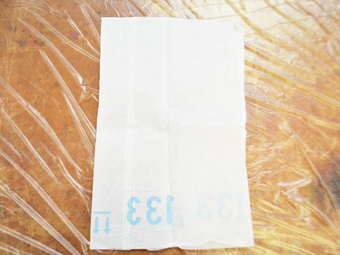

# 01.材料・道具と事前準備
 

## 材料・道具
 

 
 

* **生漆** 
200gで、300 x 600mmのMDFを10枚程度塗ることができます。 
（購入元例 ▶ [http://urushiya.ocnk.net/product/271](http://urushiya.ocnk.net/product/271)）
* **MDF**
* **ケーク紙** 
漆を塗る際に使用します。 
（購入元例 ▶ [http://urushiya.ocnk.net/product/1256](http://urushiya.ocnk.net/product/1256)）
* **テレピン油** 
漆の希釈や、ガラス板、ヘラの洗浄に使用します。 
（購入元例 ▶ [http://urushiya.ocnk.net/product/939](http://urushiya.ocnk.net/product/939)）
* **なたね油** 
（刷毛洗浄や、肌に漆がついたときの拭き取りに使用します。）
* **ウエスもしくはキッチンペーパー** 
（ガラス板の掃除用です。）
* **ゴム手袋もしくはビニール手袋**
* **エプロン**
* **やすり（#400）**
* **ガラス板** 
※ガラス製の製の器やボウル等でも代用可能です。 
（購入元例 ▶ [https://www.monotaro.com/p/3323/4354/?t.q=%83K%83%89%83X%94%C2](https://www.monotaro.com/p/3323/4354/?t.q=%83K%83%89%83X%94%C2)）
* **板材** 
ガラス板と同じサイズで厚さ10mm程度のものをご用意ください。 
（※ガラス板を使用しない場合は不要です。）
* **プラスチック製のヘラ** 
※ガラス板ではなく、ガラス製の器等で漆を混ぜる場合はプラスチックスプーンでも代用可能です。 
（購入元例 ▶ [http://urushiya.ocnk.net/product/157](http://urushiya.ocnk.net/product/157)）
* **養生シート** 
テーブルや椅子を養生できるものであれば、100円ショップで販売されている 
レジャーシート等でも問題ありません。
* **保管ケース** 
拭き漆をしたMDFや木地が入るものであれば、ダンボールや収納ケースでかまいません。
* **新聞紙** 
保管ケース内の湿度を保つために使用します。
* **ぞうきん** 
保管ケース内に水を塗布するのに使用します。
* **割り箸** 
拭き漆仕上げをした木材などをケースで硬化させる際に使用します。 
100円ショップ等で売っている鳩よけを小さくカットしたものでもOKです。

## 事前準備
 

  
  
 

ケーク紙を幅15cm程度にカットします。（手で大まかにちぎっても問題ありません。） 
 
 
 

  
 

拭き漆MDFを入れておくための**『室（ムロ）』**（段ボールや収納ケース等）に 
新聞紙を敷き、雑巾などを使って全体を湿らせておきます。 
 
 
 

  
 

**『室（ムロ）』**の中に割り箸等、拭き漆MDFを置いておくための支えをセットします。  
 
 
 

 
 

作業を行なうテーブルに養生シートやビニールなどを敷き、エプロンと手袋を装着します。 
（かぶれが心配な方は、ハンドクリームやオイルなどを手に塗っておきましょう。） 
 
 
 

  
 

ビニール手袋で服の袖を覆い、その上から養生テープを巻いて留めると尚良いです。 
 
 
 
 
 
 
