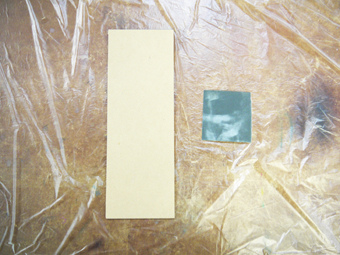
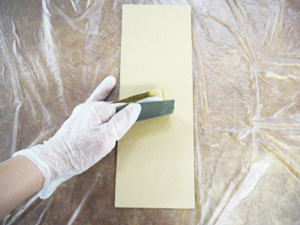
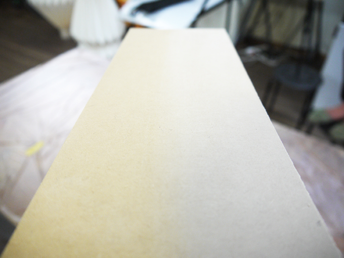

# 02-1.やすりがけ
 

**動画｜MDFのやすり方：[https://youtu.be/F6EhHFjScXw](https://youtu.be/F6EhHFjScXw)** 
 
※漆は、油分があると硬化しなくなってしまうので、 
やすりがけ以降の作業は必ず手袋をして行ってください。 
 
 
 

  
 

**#400のやすり**を使用し、MDF全体にやすりがけをします。 
（側面はあまりやすらなくてもOKです。） 
平らな面にやすりがけをする場合は、木片などにやすりを巻くと作業がしやすいです。 
 
 
 

 
 

やすりがけを行っていくなかで、MDFを様々な方向から見てみたり光を当ててみると、 
テカリのある部分とマットな部分がでてくるかと思います。 
全ての面がマットになるまで丁寧にやすりをかけましょう。 
やすりがけが完了したら、乾いた布等で粉塵を拭き取ります。
 
 
 
 
 
 
