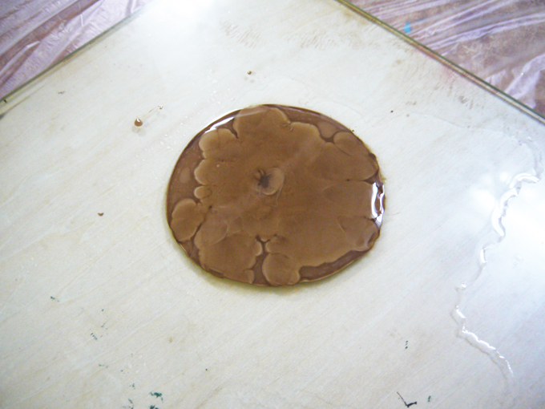
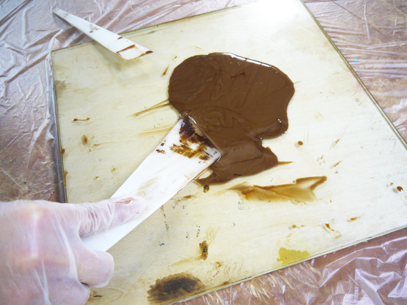

# 02-2.漆とテレピン油の混合
 

**動画｜漆とテレピン油の出し方：[https://youtu.be/sYcWJec2qwk](https://youtu.be/sYcWJec2qwk)** 

**動画｜漆とテレピン油の混ぜ方：[https://youtu.be/AvhqG4MKypM](https://youtu.be/AvhqG4MKypM)** 

 
※「生漆：テレピン油＝３：１」の比率であれば、下記の倍量を一気に作っても問題ありません。 
 
 
 

 
 

ガラス板や器に、**生漆**を大さじ3杯程度入れ、**テレピン油**を大さじ1杯程度加えます。 
 
 
 

 
 

ヘラやスプーンで、摺り合せるように混ぜます。 
漆は空気と反応して硬化が進むので、空気を含ませるようには混ぜないでください。 
 
 
 
 
 
 
