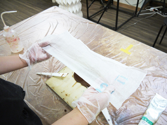

# 02-3.漆塗り
 

**動画｜ケーク紙の折りたたみ方：[https://youtu.be/Zf\_2fub28mE](https://youtu.be/Zf_2fub28mE)** 

**動画｜漆の塗り方：[https://youtu.be/xVNB9ZcGp08](https://youtu.be/xVNB9ZcGp08)** 

 
 
 

  
 

**ケーク紙**を 40mm × 50mm 程度に折りたたみます。 
 
 
 

 
 

**ケーク紙**に**漆**を付け、**MDF**に塗りつけます。 
漆はどんどん染み込んでいくので、片面ずつ根気よく塗っていきましょう。 
側面も塗ったほうが板としては見栄えが良いですが、 
レーザーカッター等でカットして使用するのであれば塗らなくてもOKです。 
両面とも塗りが完了したら、もう一度両面に漆を塗ります。 
 
 
 
 
 
 
