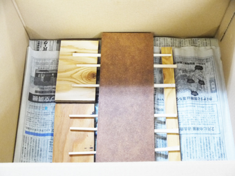

# 02-4.漆の拭き取り → 硬化
 

**動画｜漆の拭き取り方：[https://youtu.be/fJ7dORDQYzk](https://youtu.be/fJ7dORDQYzk)** 

※手袋で直接MDFに触れてしまうと跡がついてしまうので、必ずケーク紙ではさみ込むようにしてMDFを持ってください。 
 
 
 

 
 

両手に開いた状態の**ケーク紙**を持ち、片手で**MDF**を持ちます。 
そしてもう片方の手の**ケーク紙**で、**MDF**の表面に残った漆を拭き取ります。 
 
両面の拭き取りが完了したら、拭き取りをしていたほうの**ケーク紙**を 
新しいものに替えて**MDF**を持ち替え、再度表面を拭きます。 
 
 
 

  
 

全体の拭き取りが完了したら**室**（段ボールや収納ケース等）に入れます。 
（※もし室の中が乾燥していたら、濡れ雑巾等で湿らせてください。） 
 
 
 
 
 
 
