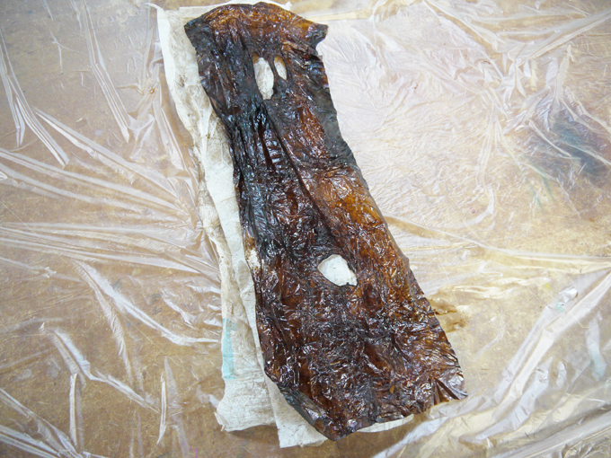

# 02-5.ガラス板等の掃除
 

**動画｜ガラス板（作業板）の掃除の仕方：[https://youtu.be/GSj78lr1kn4](https://youtu.be/GSj78lr1kn4)** 

**動画｜ケーク紙の広げ方：[https://youtu.be/CjR0mSPAmz0](https://youtu.be/CjR0mSPAmz0)** 

※手袋で直接MDFに触れてしまうと跡がついてしまうので、必ずケーク紙ではさみ込むようにしてMDFを持ってください。 
 
 
 

 
 

漆塗りの作業が完了したら、ガラス板や器に残った漆をウエスで拭き取ります。   
その後、テレピン油をガラス板（もしくは器）にかけ、 
ヘラやスプーン等でこすり落とし、ウエスで吸い取ります。   
最後にテレピン油を染み込ませたウエスでヘラ（もしくはスプーン等）をよく拭きます。 
**※使用済みのケーク紙は、1日程度広げておいてから捨てましょう。** 
 
 
 
 
 
 
