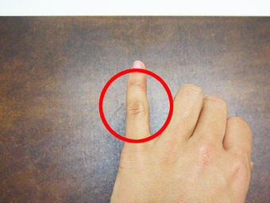
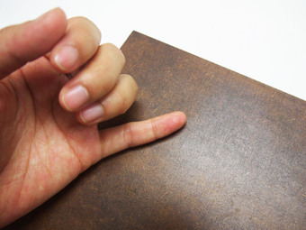

# 02-6.(硬化後)やすりがけ
 

大抵2,3日である程度硬化しますが、素手で触れての硬化の確認は、 
拭き漆作業から1週間程度時間をとってから行いましょう。 
 
 
 

  
 

小指の背面で、MDFの表面を軽く撫でて硬化の状況を確認します。 
 
* **全体的にサラッとした感触＆表面にわずかなザラつきを感じる場合** 
うまく硬化が進んでいます。 
2,3日に1回程度室（ムロ）に雑巾等で水分を与えながら更に硬化を進めましょう。 
* **しっとりとした感覚が少しでもある場合** 
硬化の進みが遅いようです。 
1日に2,3回程度室（ムロ）に雑巾等で水分を与え、気温にも気を配りましょう。 
2,3日後に再び上記方法で硬化の状況を確認してみてください。

3週間程度経ったら素材として使用しても問題ありません。   
表面を手で触ったときに少しザラつきがあるので、#800以上のやすりで撫でるようにキメを整えます。 
（力を入れると漆ごと剥がれる可能性があるので、触れるか触れないかくらいの優しい力で行いましょう。） 
 
より艶を出したい場合は、テレピン油は使用せずに再度同じ手順で拭き漆作業を行います。 
重ね塗りする場合は、1回目と2回目の間は2,3日程度空いていれば問題ありません。 
最終硬化のみ3週間程度時間を使います。 
 
 
 
 
 
 
