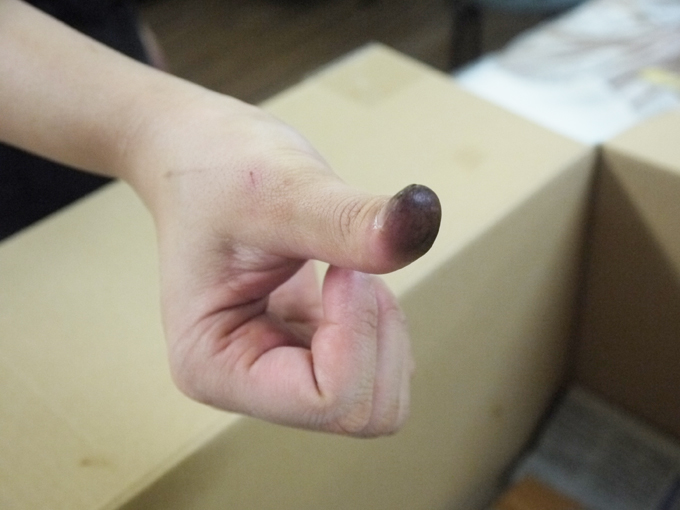
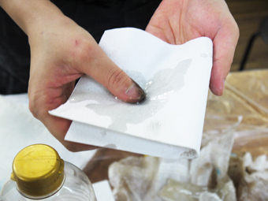
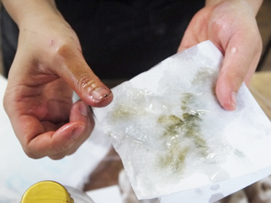
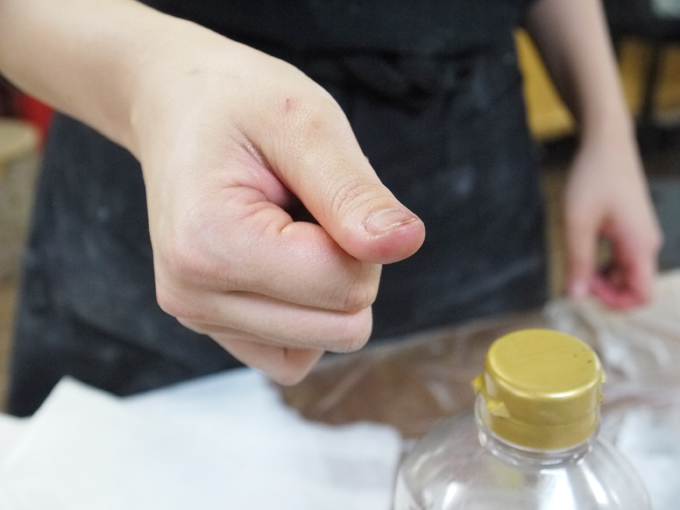
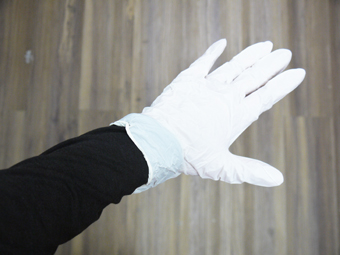
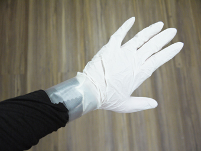

# 03.漆が肌に付着した場合
 
 

 
 

作業中にビニール手袋が破れているなどして、漆が直接地肌に付着することが度々あります。 
 
 
 

 
 

そのような場合には、キッチンペーパーなどに 
**油（なたね油など）**を染み込ませ、それを漆の付着部分に当てます。 
（テレピン油も使用可能ですが、肌が弱い方は荒れてしまうこともあるので注意してください。） 
 
 
 

 
 

少し時間をおくと漆が浮いてくるので、それをキッチンペーパーで拭き取ります。 
落ちにくい場合は、何度も油を染み込ませて拭き取ってください。 
 
 
 

 
 

漆の成分は落ちても、特に爪や皮膚のシワなどに 
色素や顔料が残ってしまう場合もありますが、このくらいまで綺麗になったら 
ハンドソープなどで手を洗い、よく保湿してください。 
 
 
 

##  その他注意事項
 

* 本漆には肌がかぶれる成分が含まれており、 
漆アレルギーをお持ちの方は稀に症状が見られる場合があります。予めご了承ください。 
（かぶれの具合は人によって大きく異なります。もしかぶれの症状が大きい場合は病院へ受診してください。）
* 漆は衣服に付着すると落ちません。汚れても良い服装で実施してください。   
腕周りは、なるべく肌は出さないようにしましょう。（エプロン、アームカバーがあると便利です。 
服の袖は、ゴム手袋の中に入れ、その上から養生テープなどで巻き留めると良いかと思います。（下図参照）  
  

* 髪の長い方は必ずまとめ、爪の長い方はなるべく切っておいてください。 
（手袋を破ってしまう可能性があります。）
* 漆の匂いが気になる方やかぶれが不安な方はマスクを着用してください。 
* 漆は硬化に時間を要するため、作業後3週間程度経ってから使用可能となります。  

 
 
 
 
 
 
