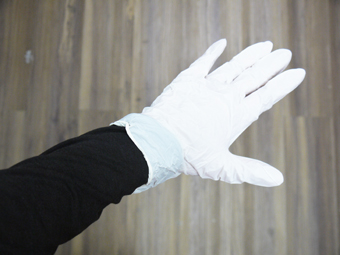

# 00.Introduction
 

木材を繊維状にほぐしたものを接着剤で固めて作られるMDFは、   
レーザー加工で使用されることの多い素材です。   
そこに漆（うるし）塗りの伝統的な技法のひとつである**“拭き漆”**を施し、  
普通のMDFとは一味違う素材に仕上げていきます。 
 
 

 
 

左が普通のMDF、右が拭き漆を施したMDFの表面です。 
本チュートリアルでは生漆を使用するので深い茶色に仕上がりますが、 
朱や黒などの色漆を使用するとまた違った表情になります。 
 
 

 
 

FabLab SENDAI - FLATでも、様々な作品の制作にこの拭き漆MDFを使用しています。 
特に、UVプリンタでの白色プリントは、非常に綺麗に仕上がるのでとてもオススメです！ 
 

▼作業の流れをまとめた動画はこちらです▼ 
[https://www.youtube.com/playlist?list=PLZnDodE3VeYUPUaUkz10JGscuksAwsW2g](https://www.youtube.com/playlist?list=PLZnDodE3VeYUPUaUkz10JGscuksAwsW2g) 
 
 
 

##  注意事項
 

* 本漆には肌がかぶれる成分が含まれており、 
漆アレルギーをお持ちの方は稀に症状が見られる場合があります。予めご了承ください。
* 漆は、酵素の働きによって硬化するため、  酵素の働く温度（25度前後）と湿度（80%以上）が必要です。 
そのため、上記環境を保つための室（ムロ／段ボールや収納ケース等）を使用しなければいけません。 
* 漆は衣服に付着すると落ちません。汚れても良い服装で実施してください。   
腕周りは、なるべく肌は出さないようにしましょう。（エプロン、アームカバーがあると便利です。 
服の袖は、ゴム手袋の中に入れ、その上から養生テープなどで巻き留めると良いかと思います。（下図参照）  
  

* 髪の長い方は必ずまとめ、爪の長い方はなるべく切っておいてください。 
（手袋を破ってしまう可能性があります。）
* 漆の匂いが気になる方やかぶれが不安な方はマスクを着用してください。 
* 漆は硬化に時間を要するため、作業後3週間程度経ってから使用可能となります。  

 
 
 
 
 
 
